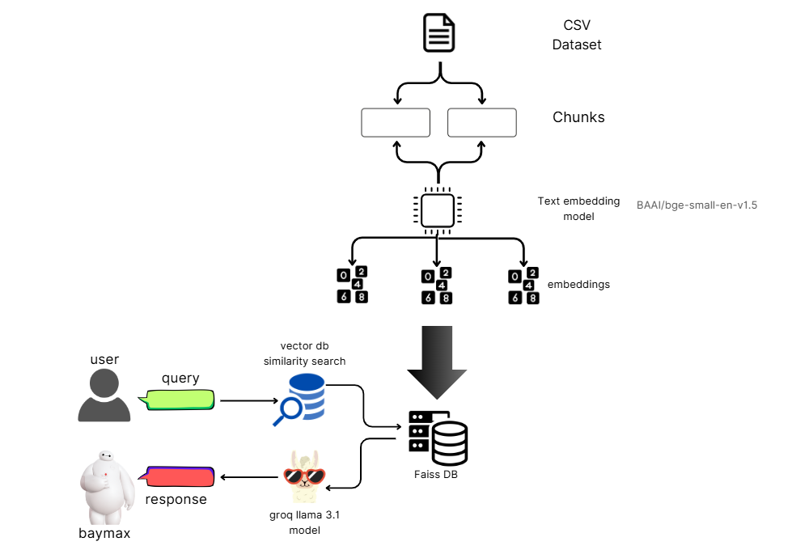

# 🤖🩺 Baymax - Your Personal Healthcare Companion

#### Baymax is a healthcare chatbot assistant built to provide users with accessible, relevant, and reliable health information. The chatbot uses Retrieval-Augmented Generation (RAG) to search a vector database of healthcare data, then generates personalized responses using a powerful language model, ensuring both contextually accurate and well-informed replies.
---------------------------------------------------------------------------------------------------------
### Pipeline Diagram

###  [Working Demo](https://github.com/0x-d15c0/Baymax/blob/main/DEMo%20(1).mp4)
---------------------------------------------------------------------------------------------------------


### Key Features
- Personalized Healthcare Responses: Customizes responses based on user-provided age, dietary restrictions, and fitness goals.<br>
- Symptom & Condition Information: Provides detailed information on symptoms, medication, and wellness.<br>
- Health Advice with RAG: Leverages Retrieval-Augmented Generation (RAG) for context-driven responses.<br>
- Personal History Storage: Stores user information to enhance response accuracy.<br>

----------------------------------------------------------------------------------------------------------
### Technology Stack
- FastAPI: Backend framework for handling API requests.
- Streamlit: Frontend for user interaction.
- LangChain: To manage the RAG architecture and chain setup.
- Groq: LLM API to generate responses. (Llama 3.1 8b params in this case)
----------------------------------------------------------------------------------------------------------
## Setup and Installation
- Clone the repository and navigate to the project directory:
```bash
git clone https://github.com/yourusername/baymax-health-assistant.git
cd baymax-health-assistant
```
- Install required dependencies:
```bash
pip install -r requirements.txt
```
- <b> Add your GROQ_API_KEY to the .env file. </b><br>

- Start the backend server:
```bash
uvicorn backend:app --reload
```
- Run the frontend:
```bash
streamlit run frontend.py
```
